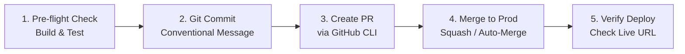

# Auto PR & Production Deployment Skill

Skill ini membakukan alur kerja agent untuk memvalidasi perubahan kode, membuat Pull Request (PR) secara otomatis menggunakan GitHub CLI (`gh`) atau Git, me-merge ke branch `main`, serta memantau deployment produksi hingga berhasil live.

---

## 📋 Alur Kerja Standar (5 Langkah)



---

## Langkah 1: Pre-Flight Verification (Wajib)
Sebelum membuat branch atau menyentuh production, pastikan kode lulus uji lokal agar tidak merusak build produksi:

1. Jalankan build check sesuai stack project:
   ```bash
   # Next.js / React / Node.js
   npm run build
   # atau pnpm build / yarn build
   ```
2. Jalankan test (jika tersedia di `package.json`):
   ```bash
   npm test -- --passWithNoTests
   ```
3. Jika build gagal, **perbaiki error terlebih dahulu sebelum melanjutkan**.

---

## Langkah 2: Branching & Staging

1. Buat branch baru dengan penamaan deskriptif:
   ```bash
   git checkout -b feature/<nama-fitur-singkat>
   # contoh: git checkout -b feature/n8n-crm-integration
   ```
2. Stage dan commit file menggunakan format **Conventional Commits**:
   ```bash
   git add .
   git commit -m "feat: <deskripsi singkat perubahan>"
   ```
3. Push branch ke remote GitHub:
   ```bash
   git push -u origin feature/<nama-fitur-singkat>
   ```

---

## Langkah 3: Membuat Pull Request (PR) Otomatis

Gunakan GitHub CLI (`gh`) untuk membuat PR secara terprogram:

```bash
gh pr create \
  --title "feat: <Judul Fitur/Perbaikan>" \
  --body "## 📌 Ringkasan Perubahan
- Menambahkan fitur X
- Memperbaiki bug Y
- Menyelaraskan integrasi Z

## 🧪 Validasi
- [x] Lulus uji lokal (npm run build)
- [x] Siap deploy ke Production" \
  --base main \
  --head feature/<nama-fitur-singkat>
```

> **Catatan Fallback**: Jika GitHub CLI (`gh`) belum login/terinstal, gunakan rute **Fast-Track Production Push**:
> ```bash
> git checkout main
> git merge feature/<nama-fitur-singkat>
> git push origin main
> ```

---

## Langkah 4: Auto-Merge ke Production

Setelah PR berhasil dibuat, lakukan merge ke branch `main`:

```bash
# Merge PR dan otomatis hapus feature branch
gh pr merge --merge --delete-branch --admin

# Atau squash merge
gh pr merge --squash --delete-branch
```

Tarik kembali branch `main` terbaru ke lokal:
```bash
git checkout main
git pull origin main
```

---

## Langkah 5: Verifikasi Deployment Produksi

1. Periksa status workflow GitHub Actions (jika ada):
   ```bash
   gh run list --limit 3
   ```
2. Untuk hosting dengan Git-Triggered Auto Deploy (Netlify, Vercel, Railway, Render):
   - Pantau URL produksi (misal: `https://fr-portofolio.netlify.app/`)
   - Buka halaman target atau uji endpoint API utama untuk memastikan fungsionalitas baru live dan tidak menghasilkan error HTTP 500.
